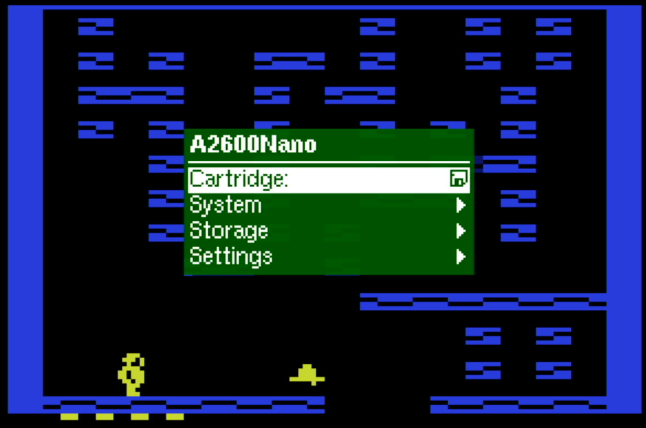

# A2600Nano
The A2600Nano is a port of the [MiSTer](https://github.com/MiSTer-devel/Atari2600_MiSTer) FPGA core components of the [Atari 2600 VCS](https://en.wikipedia.org/wiki/Atari_2600) with enhancements from the A7800 core such as cartridge type autodetect and the video stabilizer for the:<br>

| Board      | FPGA       | support |Note|
| ---        |        -   | -     |-|
| [Tang Nano 9k](https://wiki.sipeed.com/hardware/en/tang/Tang-Nano-9K/Nano-9K.html)       | [GW1NR](https://www.gowinsemi.com/en/product/detail/38/)  |X |micro SD card [HW modification](TANG_NANO_9K.md#hw-modification) needed|
| [Tang Nano 20k](https://wiki.sipeed.com/nano20k)     | [GW2AR](https://www.gowinsemi.com/en/product/detail/38/)  |X  |twin Dualshock<br> MiSTeryShield20k spare header + Joy to DIP |
| [Tang Primer 20K Dock ext Board](https://wiki.sipeed.com/hardware/en/tang/tang-primer-20k/primer-20k.html)| [GW2A](https://www.gowinsemi.com/en/product/detail/46/)| X |twin Dualshock |
| [Tang Primer 25K](https://wiki.sipeed.com/hardware/en/tang/tang-primer-25k/primer-25k.html) | [GW5A-25](https://www.gowinsemi.com/en/product/detail/60/)  | X |no Dualshock, no retro D9 Joystick |
| [Tang Mega 60k NEO](https://wiki.sipeed.com/hardware/en/tang/tang-mega-60k/mega-60k.html)|[GW5AT-60](https://www.gowinsemi.com/en/product/detail/60/)| X |twin Dualshock |
| [Tang Mega 138k Pro](https://wiki.sipeed.com/hardware/en/tang/tang-mega-138k/mega-138k-pro.html)|[GW5AST-138](https://www.gowinsemi.com/en/product/detail/60/) | X |twin Dualshock |

This project relies on a [M0S Dock BL616 µC](https://wiki.sipeed.com/hardware/en/maixzero/m0s/m0s.html) being connected to the Tang Nano 20K.  
Alternately you can use a [Raspberry Pi Pico](https://www.raspberrypi.com/documentation/microcontrollers/pico-series.html) or [esp32-s2](https://www.espressif.com/en/products/socs/esp32-s2)/[s3](https://www.espressif.com/en/products/socs/esp32-s3) and use the [FPGA companion firmware](http://github.com/harbaum/FPGA-Companion). Basically a µC acts as USB host for USB devices and as an OSD controller using a [SPI communication protocol](https://github.com/harbaum/MiSTeryNano/blob/main/SPI.md).<br>

There is a nice [case](https://github.com/vossstef/A2600Nano/tree/main/housing3D) available mounting the [MiSTeryShield20k](https://github.com/harbaum/MiSTeryNano/tree/main/board/misteryshield20k/README.md) (TN20k + M0S).

Original A2600 core by [Retromaster](https://retromaster.wordpress.com/a2601/)  
All HID, SDcard and µC firmware by [Till Harbaum](http://www.harbaum.org/till/mist)<br>

Features:
* PAL 768x576p or NTSC 768x480p HDMI Video and Audio Output
* Scanline length auto adjust
* Cartridge type autodetect
* NTSC / PAL region autodetct
* Superchip autodetct
* [USB Keyboard](https://en.wikipedia.org/wiki/Computer_keyboard) USB Keyboard
* [USB Joystick](https://en.wikipedia.org/wiki/Joystick)
* [USB Gamepad](https://en.wikipedia.org/wiki/Gamepad) Stick as paddle emulation<br>
* [USB Mouse](https://en.wikipedia.org/wiki/Computer_mouse) as paddle emulation
* supports 2nd Trigger Button for modified Games
* [legacy D9 Joystick](https://en.wikipedia.org/wiki/Atari_CX40_joystick) (Atari / Commodore digital type) [MiSTeryShield20k](https://github.com/harbaum/MiSTeryNano/tree/main/board/misteryshield20k/README.md)<br>
* Joystick emulation on Keyboard [Numpad](https://en.wikipedia.org/wiki/Numeric_keypad)<br>
* [Dualshock 2 Controller Gamepad](https://en.wikipedia.org/wiki/DualShock) for [MiSTeryShield20k](https://github.com/harbaum/MiSTeryNano/tree/main/board/misteryshield20k/README.md) via spare [pinheader](shield_ds_cable.md)
* [Dualshock 2 Controller Gamepad](https://en.wikipedia.org/wiki/DualShock) Keys & Stick as Joystick<br>
* [Dualshock 2 Controller Gamepad](https://en.wikipedia.org/wiki/DualShock) Sticks as paddle emulation (analog mode)<br>
* Cartridge ROM loader. [Boot default is homebrew 'Hunchy' Chris Walton](https://videogamehomebrew.fandom.com/wiki/Chris_Walton)  

<br>

<br>

## A2600Nano on Tang Nano 9K
See [Tang Nano 9K](TANG_NANO_9K.md)

## A2600Nano on Tang Primer 20K (Dock ext board)
See [Tang Primer 20K](TANG_PRIMER_20K.md)<br>

## A2600Nano on Tang Primer 25K
See [Tang Primer 25K](TANG_PRIMER_25K.md)

## A2600Nano on Tang Mega 60k NEO
See [Tang Mega 60K NEO](TANG_MEGA_60K.md)

## A2600Nano on Tang Mega 138k Pro
See [Tang Mega 138K Pro](TANG_MEGA_138Kpro.md)

## Installation

The installation of A2600Nano on the Tang Nano 20k board can be done using a Linux PC or a Windows PC
[Instruction](INSTALLATION_WINDOWS.md).<br>

## Cartridge ROM Loader
ROM can be loaded via OSD file selection.<br>

### Supported mappers
* Auto detected  (F8 F6 FE E0 3F F4 P2 FA CV 2K UA E7 F0 32)<br>
  
LED 1 to 5 are activated as hint in case an unsupported game (mapper) detected<br>

### single / dual Button Joystick
* Button ```Trigger```
* 2nd Button ```Trigger 2```

### Gamepad
* Gamepad Button ```Trigger A (DS2 circle)``` 1st Trigger Button

* Gamepad Button ```Trigger B (DS2 cross)``` 2nd Trigger Button

* Gamepad Button ```Trigger X (DS2 triangle)``` 1st Paddle Trigger and enable

* Gamepad Button ```Trigger Y (DS2 square)``` 2nd Paddle Trigger and enable

* Gamepad Button ```START``` as core function **START**<br>

* Gamepad Button ```SELECT``` as core function **SELECT**<br>

> [!NOTE]
> Gamepad button keymap optimized for legacy USB Logitech RumblePad 2 or Dual Action. Keymap might differ for other Gamepads.

### Paddle
* DualShock 2 (left Stick), USB Gamepad or USB Mouse.<br>

1st Paddle 1st Gamepad use ```Trigger X (DS2 #1 triangle)``` or ```left Mouse Button```

2nd Paddle 1st Gamepad use ```Trigger Y (DS2 #1 square)``` or ```right Mouse Button```

3rd Paddle 2nd Gamepad use ```Trigger X (DS2 #2 triangle)```

4th Paddle 2nd Gamepad use ```Trigger Y (DS2 #2 square)```

### Keyboard
* Key **F11** as core function ```START``` <br>
* Key **PAGE UP** as core function ```SELECT``` <br>

| Numpad          |         |Numpad|
| -          |-        |-         |
|0<br>Trigger|8<br>Up  |.<br>Trigger 2|
|4<br>Left   |-        |6<br>Right|
|-           |2<br>Down|-         |

## Push Button utilization
* **S2** keep pressed during power-up to prevent FPGA bitstream load from FLASH.<br>

* **S1** reserved <br>

## OSD
invoke by F12 keypress<br>
* Reset<br>
* Cold Reset<br>
* Audio Volume + / -<br>
* Scanlines effect %<br>
* Region switch Auto/NTSC/PAL<br>
* HID device selection for Joystick Port<br>
* Loader file selection<br>
* Difficulty A, B Core switch
* Black & White Core video switch
* Joystick port swap
* Invert Paddle
* De-comb
* SuperChip Auto/off/on

## Gamecontrol support

A 2nd Trigger Button (B) is supported for modified Games.

 <br>

legacy single D9 Digital Joystick. OSD: **Retro D9**<br>
or<br>
USB Joystick(s) or Gamepad(s). OSD: **USB #1 Joy** or **USB #2 Joy** <br>
Also [RII Mini Keyboard i8](http://www.riitek.com/product/220.html) left Multimedia Keys are active if **USB #1 Joy** selected.  <br>
```Button A and B``` Buttons as Trigger:<br>

or<br>
Dualshock 2 Gamepad Stick or Dpad as Joystick. OSD: **DS #1 Joy** or **DS #2 Joy**<br>
At the moment Dpad only for original Pad. Some clone devices support at the same time Dpad and left stick simultaniously.
<br>```circle and cross``` Buttons as Trigger:<br>

> [!IMPORTANT]
> In a [MiSTeryShield20k](https://github.com/harbaum/MiSTeryNano/tree/main/board/misteryshield20k) configuration Dualshock is supported via the internal ``spare J8`` pinheader. <br>
> See MiSTeryShield20k [DS Adapter Cable](shield_ds_cable.md) for further information.<br>

> [!NOTE]
> TN20k: You have to select OSD "DS2 **#2** Joy" for a ``MiSTeryShield20k`` configuration.<br>
> TN20k: You have to select OSD "DS2 **#1** Joy" if you use the ``Sipeed Joy to DIP`` adapter.<br>
Both DS interface ports can be active at the same time meaning twin Dualshock support if the MiSTeryShield20k MIDI interface is not populated (Resistor R9 and IC U3 removed).  

or<br> Keyboard Numpad. OSD: **Numpad**<br>

or<br> Mouse. OSD: **Mouse**<br>
```left Mouse Button``` and ```right Mouse Button``` as Trigger for Paddle 1 or 2.<br>

or<br> USB Gamepad as Paddle. OSD: **USB #1 Padd** or **USB #2 Padd** <br>
 ```Trigger X``` and ```Trigger Y``` 

or<br> Dualshock2 Gamepad left stick as Paddle. OSD: **DS #1 Paddle** or **DS #2 Paddle**<br>

 ```Trigger triangle``` and ```Trigger square``` 

## LED UI

| LED | function         |TN9K|TN20K|TP20K|TP25K|TM60K|TM138k|
| --- |        -         |-   |-     |-      | -     | -      | -   |
| 0   |Cartridge selected|x   |x     |x      | x     | x      | x   |
| 1   | Game unsupported |x   |x     |x      | x     | x      | x   |
| 2   | Game unsupported |x   |x     |x      |  -    | -      | x   |
| 3   | Game unsupported |x   |x     |x      |  -    | -      | x   |
| 4   | Game unsupported |x   |x     |x      |  -    | -      | x   |
| 5   | Game unsupported |x   |x     |x      |  -    | -      | x   |

LED 1..5 are activated as hint in case an unsupported game (mapper) detected<br>

**Multicolor RGB LED**
* **<font color="green">green</font>**&ensp;&thinsp;&ensp;&thinsp;&ensp;&thinsp;all fine and ready to go<br>
* **<font color="red">red</font>**&ensp;&thinsp;&ensp;&thinsp;&ensp;&thinsp;&ensp;&thinsp;&ensp;&thinsp;something wrong with SDcard / default boot image<br>
* **<font color="blue">blue</font>**&ensp;&thinsp;&ensp;&thinsp;&ensp;&thinsp;&ensp;&thinsp;µC firmware detected valid FPGA core<br>
* **<font color="yellow">yellow</font>**&ensp;&thinsp;&ensp;&thinsp;&ensp;&thinsp;FPGA core can't detect valid firmware<br>
* **white**&ensp;&thinsp;&ensp;&thinsp;&ensp;&thinsp;-<br>
## Powering
Prototype circuit with Keyboard can be powered by Tang USB-C connector from PC or a Power Supply Adapter. 
## Synthesis
Source code can be synthesized, fitted and programmed with GOWIN IDE Windows or Linux.<br>
Alternatively use the command line build script **gw_sh.exe** build_tn20k.tcl<br>
## HW circuit considerations
**Pinmap TN20k Interfaces** <br>
 Sipeed M0S Dock, digital Joystick D9 and DualShock Gamepad connection.<br>
 

**Pinmap D-SUB 9 Joystick Interface** <br>
- Joystick interface is 3.3V tolerant. Joystick 5V supply pin has to be left floating !<br>


| Joystick pin |IO| Tang Nano pin | FPGA pin | Joystick Function |
| ----------- |-----| ---   | --------  | ----- |
| 1 |2| J6 10  | 25   | UP | 
| 2 |1| J6 9  | 28 | DOWN |
| 3 |4| J6 12 | 29 | LEFT |
| 4 |3| J5 11 | 26 | RIGHT |
| 5 |-| - | - | POT Y | - |
| 6 |0| J5 8 | 27 | TRIGGER|
| 7 |-| n.c | n.c | 5V | - |
| 8 |-| J5 20 | - | GND | - |
| 9 |-| - | - | POT X | - |

**Pinmap Dualshock 2 Controller Interface** <br>

| DS pin | Tang Nano pin | FPGA pin | DS Function |
| ----------- | ---   | --------  | ----- |
| 1 | J5 18 | 71 MISO | JOYDAT  |
| 2 | J5 19 | 53 MOSI  | JOYCMD |
| 3 | n.c. | - | 7V5 |
| 4 | J5 15 | - | GND |
| 5 | J5 16| - | 3V3 |
| 6 | J5 17 | 72 CS | JOYATN|
| 7 | J5 20 | 52 MCLK | JOYCLK |
| 8 | n.c. | - | JOYIRQ |
| 9 | n.c. | - | JOYACK |


## Getting started

In order to use this Design the following things are needed:

[Sipeed M0S Dock](https://wiki.sipeed.com/hardware/en/maixzero/m0s/m0s.html) or Raspberry Pi Pico RP2040 or ESP32-S2/S3<br>
[Tang Nano 20k](https://wiki.sipeed.com/nano20k) <br>
or [Tang Primer 20K with Dock ext Board](https://wiki.sipeed.com/hardware/en/tang/tang-primer-20k/primer-20k.html)<br>
and [M0S PMOD adapter](https://github.com/harbaum/MiSTeryNano/tree/main/board/m0s_pmod/README.md).<br>
and [PMOD DS2x2](https://wiki.sipeed.com/hardware/en/tang/tang-PMOD/FPGA_PMOD.html#PMOD_DS2x2)<br>
or [Tang Nano 9k](https://wiki.sipeed.com/hardware/en/tang/Tang-Nano-9K/Nano-9K.html)<br>
or [Tang Primer 25k](https://wiki.sipeed.com/hardware/en/tang/tang-primer-25k/primer-25k.html)<br>
and [PMOD DVI](https://wiki.sipeed.com/hardware/en/tang/tang-PMOD/FPGA_PMOD.html#PMOD_DVI)<br>
and [PMOD TF-CARD V2](https://wiki.sipeed.com/hardware/en/tang/tang-PMOD/FPGA_PMOD.html#PMOD_TF-CARD)<br>
and [PMOD SDRAM](https://wiki.sipeed.com/hardware/en/tang/tang-PMOD/FPGA_PMOD.html#TANG_SDRAM)<br>
and [M0S PMOD adapter](https://github.com/harbaum/MiSTeryNano/tree/main/board/m0s_pmod/README.md)
 or ad hoc wiring + soldering.<br>
or [Tang Mega 60K NEO](https://wiki.sipeed.com/hardware/en/tang/tang-mega-60k/mega-60k.html)<br>
and [PMOD DS2x2](https://wiki.sipeed.com/hardware/en/tang/tang-PMOD/FPGA_PMOD.html#PMOD_DS2x2)<br>
and [M0S PMOD adapter](https://github.com/harbaum/MiSTeryNano/tree/main/board/m0s_pmod/README.md)<br>
or [Tang Mega 138k Pro](https://wiki.sipeed.com/hardware/en/tang/tang-mega-138k/mega-138k-pro.html)<br>
and [PMOD DS2x2](https://wiki.sipeed.com/hardware/en/tang/tang-PMOD/FPGA_PMOD.html#PMOD_DS2x2)<br>
and [M0S PMOD adapter](https://github.com/harbaum/MiSTeryNano/tree/main/board/m0s_pmod/README.md)<br>
microSD or microSDHC card FAT/exFAT formatted<br>
TFT Monitor with HDMI Input and Speaker<br>
<br>

| HID and Gamecontrol Hardware option | TN20k needs | alternative option |Primer 25K|Mega 60K|Mega 138K Pro|
| -----------                         | ---         | ---                | ---      | -      | -       |
| USB Keyboard | [USB-C to USB-A adapter](https://www.aliexpress.us/item/3256805563910755.html) | [4 port mini USB hub HS8836A](https://a.aliexpress.com/_EIidgjH)  |x|x|x|
| [USB Joystick(s)](https://www.speedlink.com/en/COMPETITION-PRO-EXTRA-USB-Joystick-black-red/SL-650212-BKRD)| [4 port mini USB hub HS8836A](https://a.aliexpress.com/_EIidgjH) | - |x|x|x|
| USB Mouse   | [4 port mini USB hub HS8836A](https://a.aliexpress.com/_EIidgjH)  | -  |x|x|x|
| USB Gamepad |[4 port mini USB hub HS8836A](https://a.aliexpress.com/_EIidgjH)  | -  |x|x|x|
| Commodore/[Atari](https://en.wikipedia.org/wiki/Atari_CX40_joystick) compatible retro D9 Joystick| [MiSTeryNano shield](https://github.com/harbaum/MiSTeryNano/tree/main/board/misteryshield20k/README.md)|D-SUB 9 M connector, breadboard to wire everything up, some jumper wires|-|adhoc SDRAM1 Joy D9|adhoc PMOD Joy D9|
| [Dualshock 2 Controller Gamepad](https://en.wikipedia.org/wiki/DualShock) | Gamepad Adapter Board (Sipeed Joystick to DIP) respectively<br> PMOD DS2x2 | breadboard to wire everything up and some jumper wires |-|PMOD DS2x2|PMOD DS2x2|
