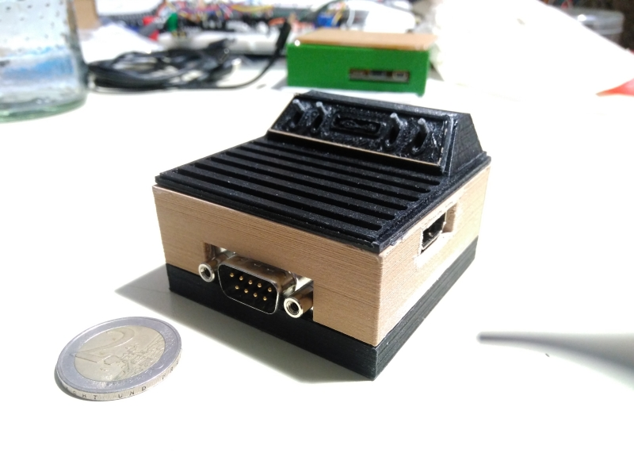

# 3D Housing for the MiSTeryNano20k shield

This is a simple housing consisting of a base, lid and hat.  
Mixed and build upon [my own case](https://github.com/harbaum/MiSTeryNano/tree/main/board/misteryshield20k/housing3D) and [this one](https://www.thingiverse.com/thing:2269086/).

Holes are for M3x12 screws, but case also lasts without them.  
License of this 3rd Party object is [CC BY-NC-SA 4.0](https://creativecommons.org/licenses/by-nc-sa/4.0/)

